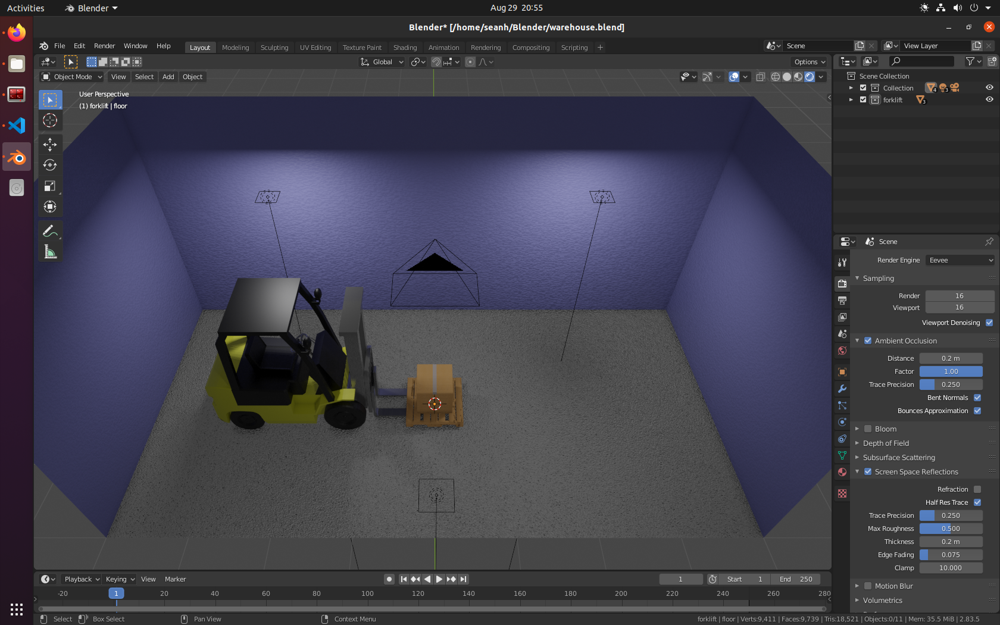

# Synthetic Data creation with Blender

## Set the Scene

- Create Objects
- Texture Objects
- Set Lighting
- Set Camera



## Create Photorealistic scenes

- Recreate textures/bump-maps etc from photos
- Recreate camera perspective using tools like `f-spy`
- Use `CYCLES` rendering engine

## Randomise the scene with Python scripts

Use the blender python api `bpy`

Create as many iterations & augmentations as required

- Light Intensity, Position, Count
- Camera Position, Focal Length, Orientation
- Object Positions, Types, Distortions, Count

## Perfectly Annotated Rendered Scenes

We can know everything about the scene, making it possible to

- Generate an image of the scene
- Generate the image's corresponding segmentation-map
- Generate the image's corresponding depth-map

## Script the Randomise/Render workflow

The following example scripts will generate 10 sets of
- Segmentation Map
- RGB Image
- Depth Map

Each set with a new position for the objects in the scene with name `Box` & `Pallet`

```
import cv2
import bpy
import bpycv
import random

for n in range(10):
    print(n) 

    # move box/pallet obj randomly in scene
    for obj in bpy.data.objects:
        print(obj.name)
        if "Box" in obj.name:
            obj.location[0]=random.uniform(0, 1.7)-0.5
            obj.location[1]=random.uniform(0, 2.0)-1.0
        if "Pallet" in obj.name:
            obj.location[0]=random.uniform(0, 1.7)-0.5
            obj.location[1]=random.uniform(0, 2.0)-1.0
    

    # give each mesh uniq inst_id for segmentation
    counter=1
    for obj in bpy.data.objects:
        if obj.type == "MESH":
            obj = bpy.context.active_object
            obj["inst_id"] = counter
            counter=counter+1

    # render image, instance annotation and depth in one line code
    result = bpycv.render_data()

    # write visualization inst|rgb|depth 
    cv2.imwrite(
        "(inst|rgb|depth)." + str(n) + ".jpg", cv2.cvtColor(result.vis(), cv2.COLOR_RGB2BGR)
    )
```

## Build a synthetic data set

- Images show some generated(segmentation-map, rgb, depth-map) sets for visualization

.0.jpg)
.1.jpg)
.2.jpg)
.3.jpg)

## Run blender headless on a server with GPU

- Render faster with a GPU
- Blender can be run without GUI, supplying `--background` option
```
blender --background --python generate_synthetic_data.py
``` 