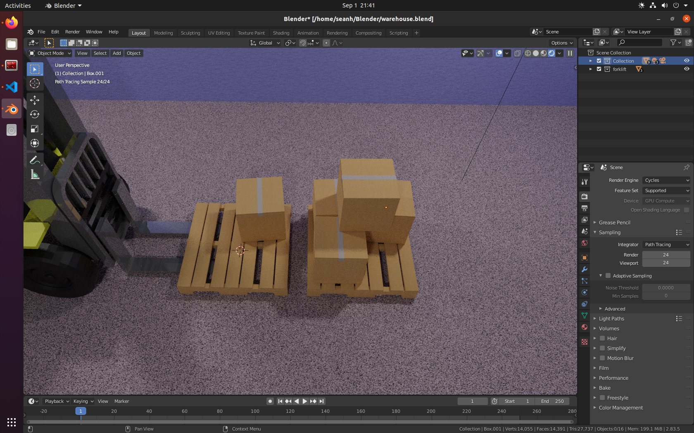
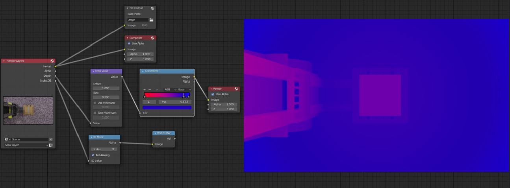
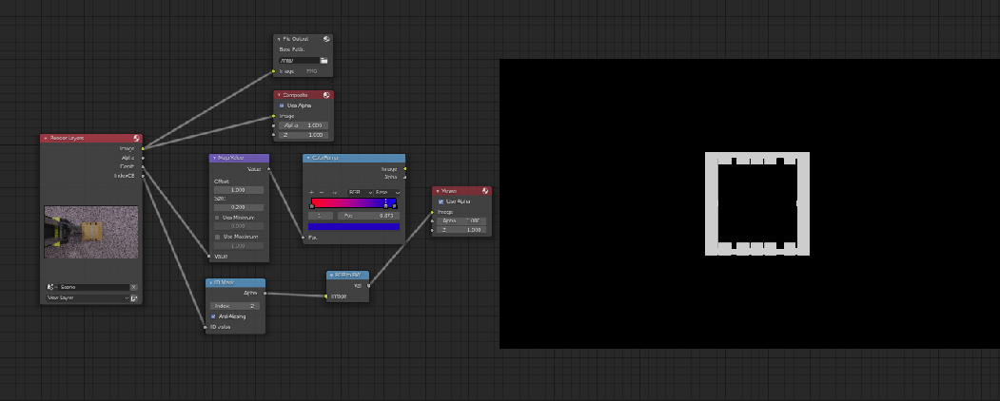

# Synthetic Data creation with Blender

- [Synthetic Data creation with Blender](#synthetic-data-creation-with-blender)
  * [Intro](#intro)
    + [Why Blender](#why-blender)
    + [Open Source Image Data Sets](#open-source-image-data-sets)
    + [Synthetic Data Sets](#synthetic-data-sets)
    + [A Combination](#a-combination)
  * [Create Realistic scenes](#create-realistic-scenes)
  * [Randomise the scene with Python scripts](#randomise-the-scene-with-python-scripts)
    + [Complex Scenes](#complex-scenes)
  * [Perfectly Annotated Rendered Images](#perfectly-annotated-rendered-images)
  * [Out of the Box](#out-of-the-box)
    + [Depth Data](#depth-data)
    + [Object Segmentation](#object-segmentation)
  * [Script the Augmentation/Render/Annotate workflow](#script-the-augmentation-render-annotate-workflow)
  * [(Demonstration) Build an annotated synthetic data set](#-demonstration--build-an-annotated-synthetic-data-set)
  * [Scaling - Run blender headless on a server with GPU](#scaling---run-blender-headless-on-a-server-with-gpu)

## Intro
Computer Vision A.I. requires many thousands of anottated images for training.
3D rendered images can provide many variations with flawless automatic annotations.
Blender is a great tool for creating computer vision training datasets.

### Why Blender
Blender is free to use, provides the interfaces set setting up our environment
- Modelling
- Shading
- Rendering
- Compositing
- Custom Annotation
- Python API
- Scalable

### Open Source Image Data Sets
- Pros
    - Freely available
    - Many objects available with annotations

- Cons
    - Many mistakes
    - May not be specific enough
    - Adding your own objects & annotations is an expensive time consuming process
    - Missing Annotation

### Synthetic Data Sets

- Pros
    - Flawless Annotations
    - Automatic Annotations
    - Impossible Annotations
        - Hidden Key Points on Objects
        - Perfect Depth Maps for every image
    - Perfect Segmentation Maps for every object in image
    - Custom annotations 
        - Python API lets us know everything about the scene
        - Create annotations in any format you need using Python
    - Infinite augmentations
    - Re-create rare cases with many augmentations

Cons
 - May not be representative of real world
 - Effort required for photorealism
 - Requires GPU access for speed/scalability

### A Combination

Combining Real & Synthetic Data may give even better results

## Create Realistic scenes

- Add meshes for objects you need in your images
- Create textures etc from photos, add them to mesh objects
- Match camera perspective using tools like `f-spy`
- Use `CYCLES` rendering engine for realistic ray traced lighting


## Randomise the scene with Python scripts

Use the blender python api `bpy`

Create as many iterations & augmentations as required.  
Changing things such as:
- Object Scale, Position, Orientation, Texture, Count
- Camera Orientation, Focal Length, FOV
- Lighting
- Swap textures
- Swap background

### Complex Scenes

Collision detection required for more complex scenes
- Avoid Floating Objects
- Avoid Intersecting Objects




## Perfectly Annotated Rendered Images

We can know everything about the scene, making it possible to generate an image of the scene & corresponding
- object segmentation maps/masks
- depth-map
- key points
- labels
- bounding boxes
- pose co-ordinates

## Out of the Box

### Depth Data
Depth Data is available out of the box in blender.  
Here a composition shows it visually.  


### Object Segmentation
Individual Object Segmentation Maps can be made by marking each object with a unique `pass index` & enabling `Object Index Pass` as a render Option  
Here a composition shows it visually.  


## Script the Augmentation/Render/Annotate workflow

Using blender's Python API we can script the changes and render workflow.

The following example scripts will generate 10 sets of
- Segmentation Map
- RGB Image
- Depth Map

Each set with a new position for the objects in the scene with name `Box` & `Pallet`

```
import cv2
import bpy
import bpycv
import random

for n in range(10):
    print(n) 

    # move box/pallet obj randomly in scene
    for obj in bpy.data.objects:
        print(obj.name)
        if "Box" in obj.name:
            obj.location[0]=random.uniform(0, 1.7)-0.5
            obj.location[1]=random.uniform(0, 2.0)-1.0
        if "Pallet" in obj.name:
            obj.location[0]=random.uniform(0, 1.7)-0.5
            obj.location[1]=random.uniform(0, 2.0)-1.0
    

    # give each mesh uniq inst_id for segmentation
    counter=1
    for obj in bpy.data.objects:
        if obj.type == "MESH":
            obj = bpy.context.active_object
            obj["inst_id"] = counter
            counter=counter+1

    # render image, instance annotation and depth in one line code
    result = bpycv.render_data()

    # write visualization inst|rgb|depth 
    cv2.imwrite(
        "(inst|rgb|depth)." + str(n) + ".jpg", cv2.cvtColor(result.vis(), cv2.COLOR_RGB2BGR)
    )
```

## (Demonstration) Build an annotated synthetic data set

- Images show some generated(segmentation-map, rgb, depth-map) sets for visualization

.0.jpg)
.1.jpg)
.2.jpg)
.3.jpg)

## Scaling - Run blender headless on a server with GPU

- Render faster with a GPU
- Blender can be run without GUI, supplying `--background` option
```
blender --background warehouse_scene.blend --python generate_synthetic_data.py
``` 